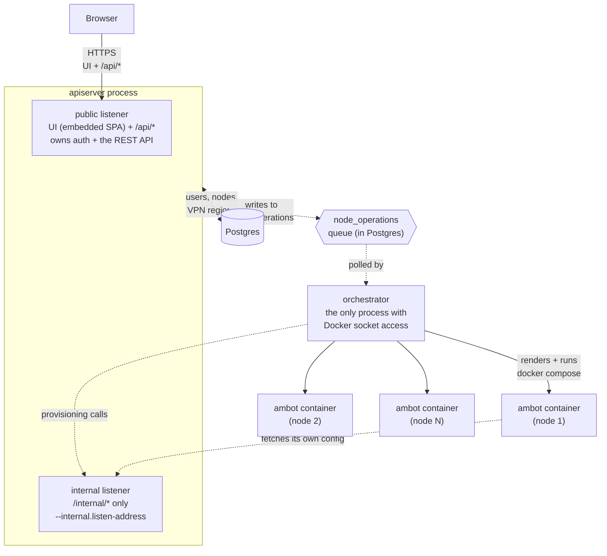

# Multi-tenant hosting

This document covers the **hosted control plane** — a separate system from
the standalone `ambot` binary the rest of this repo's [README](../README.md)
describes. It lets one operator (the admin) host isolated `ambot` instances
for multiple users, each fully separated from the others, with a web UI
instead of hand-edited `config.yaml` files.

If you just want to run `ambot` for your own single account, you don't need
any of this — see the main [README](../README.md) instead.

## Architecture



apiserver and orchestrator **never call each other directly for provisioning
decisions** — the `node_operations` table in Postgres is the only channel
between them for that; they do still talk over HTTP for the internal
endpoints above (a deliberate, separate security boundary — see below).

- **`apiserver`** (`cmd/apiserver`) is the only process the browser talks to,
  and the only process that serves the UI — there is no separate frontend
  container. It owns Postgres, authentication, and the REST API. It has **no
  Docker access at all** — a compromise here can't turn into arbitrary
  command execution on the host. It runs **two independent `http.Server`s in
  one process**: a **public** listener (`--web.listen-address`, the embedded
  React SPA plus every `/api/*` route — what your reverse proxy points at)
  and an **internal** listener (`--internal.listen-address`, `/internal/*`
  only — used by ambot containers to fetch their own config, and by
  orchestrator to provision nodes). These stay on separate ports
  deliberately: both internal endpoints hand back decrypted secrets
  (game/VPN passwords), and the internal listener's port simply never being
  reachable from outside your own infrastructure is a second, independent
  layer of defense beyond the bearer-token auth those endpoints already
  require — see [Configuration reference](#configuration-reference) and the
  production compose example's own "Network shape" comment.
- **`orchestrator`** (`cmd/orchestrator`) is the only process with Docker
  access (its own user is in the `docker` group). It polls a `node_operations`
  job queue in Postgres — `apiserver` writes to that queue, `orchestrator`
  reads it. For each pending job it renders `docker-compose.yml` + env files
  for that one node and runs `docker compose` against the **host's** Docker
  daemon (via a bind-mounted socket); it also calls apiserver's internal
  listener directly to fetch a node's decrypted provisioning details.
- **`ambot`** (the same binary the standalone README describes) runs once per
  node, each in its own container, each with its own isolated Chrome profile
  and its own Prometheus metrics port. A hosted node's `ambot` doesn't read a
  local `config.yaml` — see [Config delivery](#config-delivery-and-hot-reload)
  below.

Container names include a suffix of the owning user's uuid
(`ambot-node-<id>-u<last 6 hex chars of their uuid>`) so `docker ps` shows at
a glance whose node is whose, without printing the full uuid on every line.

## Roles

There are exactly two roles. There is **no signup flow, ever** — every
account is created by the admin, out of band, by hand — except the very
first one: `apiserver` auto-creates a bootstrap admin (login/password
`admin`/`admin`) the moment it starts against a database with no users at
all (`ensureBootstrapAdmin`, `cmd/apiserver/main.go`), so a freshly stood-up
stack always has a way in without any manual seeding step. It's a no-op on
every later restart, and the account is forced through the same
`must_change_password` flow as any other — see below.

### Admin

- Creates/disables/deletes user accounts, resets a user's password (never
  their own this way — resetting always re-flags `must_change_password`,
  which would force the admin back through the change-password screen
  right after setting their own new password; both the endpoint and the
  UI refuse it, pointing at Settings' self-service change instead).
- Curates the shared VPN provider account and its catalog of exit regions
  (see [VPN model](#vpn-model)) — the admin is the only one who ever enters
  that provider's credentials.
- Sets the Prometheus instance URL apiserver proxies metric queries to.
- Can view (read-only) every user's nodes and metrics, with exactly one
  write exception: a "Diagnostics" control on a node's admin detail page
  lets them set that node's `log_level` (debug/info/warn/error) — for
  debugging a misbehaving node without needing any other access to it. A
  regular user never sees this field.
- Has **no nodes of their own** — an admin account can't create/enable/
  configure a node (enforced server-side, `requireNonAdminUser` middleware).
- Still has their own login/password (change it, `must_change_password`
  applies the same way) and display name, via the same Settings page.

### User (a friend)

- Gets **two nodes automatically** at account creation, named `player` and
  `maintenance`, both **disabled** and both **undeletable** (only
  disable-able) — see [Nodes](#nodes).
- Configures and enables/disables their own nodes: game login/password, an
  ordered list of `ambot` services (reorder/duplicate freely — e.g. buy fuel
  twice, once at each end of a run), a friendly cron-schedule builder, and a
  per-node IANA timezone.
- Optionally picks one VPN exit region for their whole account (applies to
  every one of their nodes uniformly, not chosen per node).
- Sees metrics for their own nodes only — the server always injects
  `{user_uuid="<their own uuid>"}` into every Prometheus query; there is no
  client-suppliable PromQL.
- Has no visibility into any other user's nodes, metrics, or account.

## Authentication and the password model

- Login is a plain string the admin picks (`users.login`) — **not an email
  address**, there's nothing to verify it against.
- Session: a JWT in an httpOnly cookie (`internal/auth`), `Secure` by default
  (disable only for local plain-HTTP dev, see the compose examples).
- **Every password an admin sets (account creation, or a reset for a locked
  -out user) is treated as temporary.** `users.must_change_password` starts
  `TRUE` in both cases and the frontend forces a change-password screen
  before letting that user do anything else. A self-service password change
  (from that forced screen, or later from Settings) clears the flag. This is
  intentionally the *only* server-side check — the endpoint requires no
  current-password proof, since the session cookie itself is already proof
  of identity, and re-asking for a password the caller just typed at login
  (or already knows) is pure friction for this deployment's scale (a
  handful of trusted users, not the general public).

### Login hardening

`POST /api/auth/login` is rate-limited by THREE deliberately separate
mechanisms (see `internal/api/login_guard.go`), each catching a different
attack shape and never triggering the other two on its own:

- **Password guessing** (many wrong passwords against ONE login): counts
  consecutive failures against that login, regardless of source IP, and
  bans the LOGIN after 5. This is also exactly what happens when a real
  person just mistypes their own password repeatedly.
- **Login guessing** (one IP trying many DIFFERENT logins): counts the
  number of DISTINCT logins that have failed from one IP, and bans the IP
  once that count reaches 5. Repeatedly failing the SAME login from one IP
  never grows this past 1 — an earlier version banned by a raw IP failure
  count instead, which meant one person testing their own wrong password
  banned their own IP too, with no other admin account reachable to lift
  it.
- **Sustained hammering of a small, fixed set of known logins** (e.g.
  alternating between "admin" and one known friend's login, back and
  forth, never a third): the login-guessing check above never fires
  (never more than a couple of distinct logins), and each login
  self-throttles individually at 5. A separate raw counter — every
  failure from an IP, repeats included, no distinct-login dedup — bans the
  IP once it crosses 10 (2× the per-login threshold, not an arbitrary
  number: alternating between exactly 2 known logins hits both of their
  own 5-failure caps at almost the same moment, for 10 total failures
  right then — this is exactly the point the IP itself should also stop
  being able to try a 3rd account immediately after).

All three produce `429 Too Many Requests` with `Retry-After`.

Every attempt (success or failure) is logged and recorded in Postgres
(`login_attempts`), and every ban created/lifted is recorded in
`login_ban_events` — both are permanent audit trails, unlike `login_bans`
itself, which only holds currently-active bans.

An admin sees a locked account's ban (reason, banned/unban time) and the
last 10 login attempts (success and failure, with IP + User-Agent) right
on that user's detail page, and can lift the ban early ("Unlock") — this
also lifts any ban on the IP of that account's last failed attempt, in
case a mixed incident (e.g. a shared office IP) happened to trip both
independently. A user sees their own last 10 login attempts the same way
on their Settings page (`GET /api/me/login-activity`).

Client IP is read from the raw TCP connection only (`r.RemoteAddr`), never
an `X-Forwarded-For` header — that header is trivially spoofable unless a
reverse proxy is configured to strip/overwrite it, which apiserver has no
way to verify. Deployed behind a reverse proxy, every request therefore
carries the proxy's own address, so IP-based banning effectively becomes
"ban everyone behind this proxy after 5 failures from anywhere" — accepted
as a known limitation at this project's single-reverse-proxy,
handful-of-users scale; revisit (trusted-proxy allowlist + XFF) before
relying on this at a larger one.

## Audit logging

Every mutating request (create/update/delete/disable/reset — never a plain
GET/LIST) is logged as a single structured `slog` line via
`internal/api/audit.go`'s `audit` helper, with a fixed field schema so
these lines are easy to grep/filter, or ingest into something like
Elasticsearch/Loki, without parsing free-text messages:

```text
msg=audit actor_role=admin|user actor_login=<login> actor_uuid=<uuid> action=<verb> target=<id>
```

- `actor_role`/`actor_login`/`actor_uuid` identify the CALLER (from the
  session's own JWT claims), always — even for an admin action taken on
  someone else's account. `actor_login` is cached on the JWT itself
  (`auth.Claims.Login`) specifically so this costs no extra database
  query per audited request; safe to cache because there is no
  rename-login endpoint anywhere in this codebase.
- `action` is a short, fixed, snake_case verb, e.g. `disable_user`,
  `create_node`, `set_vpn_provider_credentials`.
- `target` identifies WHAT the action was taken on — a user UUID, a
  numeric node ID (as a string), or empty for something with no ID of
  its own (e.g. the one singleton VPN provider account). It is never who
  did it — that's always the actor fields, even when an admin acts on
  another user's account.

Covers every mutating handler across users, nodes, VPN regions/provider
credentials, and Prometheus settings — both admin actions and a regular
user's own self-service actions (e.g. `change_own_password`,
`set_my_vpn_region`), not just admin ones.

## Nodes

A node is one `ambot` instance / one Docker container. Fields you'd expect:
name, game login/password, an ordered service list, one or more cron
schedules + a jitter, a timeout, and a timezone (interprets every one of
that node's cron schedules — one zone per node, not per schedule entry).

A node **cannot be enabled** until it has real game credentials, at least
one cron schedule, and a timezone (`store.ErrNodeNotReady`) — this is why
every new user's two nodes start disabled: configure first, then flip it on.
The node edit form has its own enable/disable switch right in the header,
so "finish configuring, then turn it on" is one Save instead of a trip
back to the node list. Deleting a node (except the two defaults, which can
only be disabled) tears down its container via the same `node_operations`
queue.

Each cron schedule entry supports any combination of days of the week,
plus either "every N minutes" or one or more specific hour/minute
combinations (`CronScheduleEditor` cross-multiplies the hour and minute
lists — hours `[6, 12]` × minutes `[20, 50]` fires at 6:20, 6:50, 12:20,
and 12:50) — covers real cron patterns like
`20,50 6,12 * * 1,3,5` without anyone needing to know cron syntax. An
entry outside that shape (hand-written, or a minute not on the editor's
5-minute grid) falls back to a raw, still-editable cron text field.

The game URL (`https://www.airlinemanager.com/`) is fixed — every node uses
the same one, there's no per-node field for it in the UI.

### Advanced settings

Everything else `internal/config.Config` supports (budget percentages,
good-price thresholds, hub/aircraft maintenance limits, catering options,
alliance IDs to scan — see the main README's Configuration table) lives in
a node's "Advanced settings" section on the node form, backed by
`nodes.extra_config` (JSONB — `config.Config`'s own defaults, then
`extra_config` overlaid on top; see `internal_handlers.go`). Each field is
disabled unless a service that actually reads it is currently selected
(e.g. the fuel-purchasing fields need `buy_fuel` on) — a hint next to every
field, shown on click, names exactly which service(s) use it. Two
maintenance-budget fields are shared: `hubs` and `ac_maintenance` both draw
from `budget_percent.maintenance`, so that one field is enabled by either.

`log_level` is deliberately **not** in that section — a regular user never
sees or sets it, only an admin can (`PUT /api/admin/nodes/{id}/log-level`,
from the node's admin detail page's "Diagnostics" card) — the one write an
admin can make to a node they don't own, for dialing in debug/error logging
on a misbehaving node without needing any other access to it.

### Config delivery and hot-reload

A hosted node's `ambot` container never gets game credentials via its own
environment. Instead, at startup (`--config-api-url`/`--node-id`
/`--node-token`, or the `CONFIG_API_URL`/`NODE_ID`/`NODE_TOKEN` env vars —
see `cmd/ambot/main.go`) it fetches its config from apiserver's internal,
bearer-token-authenticated endpoint (`GET /internal/nodes/{id}/config`), and
**re-fetches it at the start of every scheduled cron run**
(`ReloadConfigIfChanged`, comparing raw bytes). Updating a node's
credentials/schedule/services in the UI does **not** need — and does not
trigger — a container restart: the already-running process picks the change
up on its own next tick. `orchestrator`'s `docker compose up -d` after an
update is a near no-op for this reason (nothing in the container's own
environment changes on an update); it exists mainly to actually create the
container the first time a node is enabled, or restart it after a stop.

## VPN model

Exactly **one** VPN provider account exists, admin-configured once
(`vpn_provider_credentials`, a singleton row). The admin also curates a
catalog of exit regions under that one account (`vpn_regions` — just an
`.ovpn` file per region). Each user picks **one region for their whole
account**, applied to every one of their nodes uniformly — never a per-node
choice. Deleting a region a user has picked silently falls them back to no
VPN (`ON DELETE SET NULL`), it never blocks the delete or errors.

## Metrics

`ambot` already exposes Prometheus metrics on its own (see the main
[README](../README.md)); the hosted setup adds per-user isolation on top:

1. Each node's container publishes `/metrics` on a unique host port
   (`nodes.prometheus_port`).
2. `orchestrator` regenerates a Prometheus `file_sd_config` targets file
   after every processed job (`--prometheus-sd-file`/`PROMETHEUS_SD_FILE`,
   optional), tagging each node's scrape target with `user_uuid`/`node_id`
   labels. **This is standard Prometheus `file_sd` behavior — those labels
   get attached automatically at scrape time, no `relabel_configs` needed.**
3. `apiserver`'s `GET /api/metrics` runs a fixed, hardcoded list of PromQL
   queries against the admin-configured Prometheus URL, always with a
   server-injected `{user_uuid="<caller's own uuid>"}` selector — the
   client supplies no PromQL of its own, which is what makes the
   server-side label injection safe.

**That internal Prometheus also loads alert rules** from
`prometheus/alerts.yml` (`rule_files` in `prometheus.yml`) — no
Alertmanager is bundled, so these just show up as firing alerts on its
own `/alerts` page (`http://localhost:9091/alerts` from the dev stack)
rather than actually notifying anyone; wire up Alertmanager yourself, or
federate them into your main Prometheus (below) if it already has one.
Two rules ship today: `AmbotExporterDown` (a node's container/exporter
unreachable for 5+ minutes) and `AmbotMissedSchedule` (the node's own
cron schedule says a run was due a while ago and it hasn't happened —
computed from `am4_next_scheduled_run_timestamp_seconds`, which
`cmd/ambot` sets via the same cron library that does the actual
scheduling, so this is correct for any schedule shape, not just simple
fixed intervals).

**Both compose examples bundle their own internal-only Prometheus**
(`prometheus/prometheus.yml`, the `prometheus` service) scraping every
node via the `file_sd` targets file `orchestrator` maintains — nothing to
configure beyond pointing apiserver at it once the stack is up:
`/admin/prometheus` → `http://prometheus:9090`. This exists so hosted
nodes' noisy, per-run series never has to share your org's main/external
Prometheus (if you have one) — **later, federate from this internal
instance into that one** for long-term history/alerting, rather than
pointing external scrapers at individual nodes directly:

```yaml
# On your MAIN Prometheus, pulling a rollup from the internal one above.
scrape_configs:
  - job_name: am4bot-federate
    honor_labels: true
    metrics_path: /federate
    params:
      match[]:
        - '{__name__=~"am4_.+"}'
    static_configs:
      - targets: ["<host running the am4bot stack>:9091"]  # only if you
        # published the internal Prometheus's port -- see the compose
        # examples' own comments, off by default.
```

**`prometheus/alerts-federated.yml`** in this repo has the alert rules
from below, rewritten for that federated setup (point your external
Prometheus's `rule_files` at a copy of it) — not loaded by anything in
this repo's own compose files, since there's no external Prometheus here
to load it into. `up`-based detection (is a node's exporter even
reachable) doesn't federate under the `match[]` selector above by
default; that file's own comments explain the federation-safe
alternative it uses instead, and how to widen `match[]` if you want the
per-node version too.

If you'd rather point your own existing Prometheus directly at hosted
nodes instead of using the bundled one, that still works — it just needs
the same `file_sd_configs` job pointing at wherever you mount
`--prometheus-sd-file`'s output:

```yaml
scrape_configs:
  - job_name: am4bot-nodes
    file_sd_configs:
      - files:
          - /path/to/prometheus-sd/targets.json
        refresh_interval: 30s
```

## Configuration reference

### `apiserver`

| Flag | Env var | Required | Default | Description |
| --- | --- | --- | --- | --- |
| `--web.listen-address` | | | `:8080` | Address the PUBLIC listener (UI + `/api/*`) listens on — what your reverse proxy points at. |
| `--internal.listen-address` | `INTERNAL_LISTEN_ADDRESS` | | `:8081` | Address the INTERNAL listener (`/internal/*`, used by ambot containers and orchestrator) listens on. A deliberately separate port from `--web.listen-address` — never point a public reverse proxy at it, see [Architecture](#architecture). |
| `--web.route-prefix` | `WEB_ROUTE_PREFIX` | | (none) | Mounts the PUBLIC listener (UI + `/api/*`) under this path instead of `/` — e.g. `/app`, so a reverse proxy can serve this UI and something else (Prometheus at `/prometheus`, say) on the same port/domain with no path-rewriting rules, the same route-prefix idea Prometheus/Grafana themselves offer. Must start with `/` and not end with one. Never affects the INTERNAL listener. |
| `--database-url` | `DATABASE_URL` | yes | | Postgres connection string. |
| `--secrets-master-key` | `SECRETS_MASTER_KEY` | yes | | Base64 AES-256 key encrypting node/VPN secrets at rest. **Losing it is unrecoverable data loss — see [Secrets and key management](#secrets-and-key-management) before generating one.** |
| `--jwt-signing-key` | `JWT_SIGNING_KEY` | yes | | Base64 key (≥32 bytes) signing session tokens. `openssl rand -base64 64` recommended. |
| `--cookie-secure` | | | `true` | Mark the session cookie `Secure` (HTTPS-only). Disable (`--no-cookie-secure`) only for local plain-HTTP dev. |
| `--orchestrator-token` | `ORCHESTRATOR_TOKEN` | yes | | Shared secret `orchestrator` authenticates its provisioning requests with — must match orchestrator's own `--orchestrator-token`. |
| `--target-host` | `TARGET_HOSTS` | yes | | Repeatable. A host label new nodes may be assigned to (round-robin by node id). Purely informational today — see [Known limitations](#known-limitations). |
| `--prometheus-port-range-start` | | | `9200` | Start of the port range allocated to nodes' Prometheus endpoints. |
| `--prometheus-port-range-end` | | | `9299` | End (inclusive) of that range. |

### `orchestrator`

| Flag | Env var | Required | Default | Description |
| --- | --- | --- | --- | --- |
| `--database-url` | `DATABASE_URL` | yes | | Same Postgres as apiserver. |
| `--api-base-url` | `API_BASE_URL` | yes | | apiserver's own INTERNAL listener base URL (e.g. `http://apiserver:8081`) — reached from orchestrator's own container. Not the public listener's port — `/internal/*` only lives on the internal one. |
| `--orchestrator-token` | `ORCHESTRATOR_TOKEN` | yes | | Must match apiserver's. |
| `--compose-dir` | `COMPOSE_DIR` | yes | | Directory to render each node's compose files under (one subdirectory per node) — must be an absolute path identical on the host and inside this container (see the compose examples' own comments on why). |
| `--ambot-image` | `AMBOT_IMAGE` | | `ashokhin/am4bot:latest` | Image every node's `ambot` container runs. |
| `--ambot-pull-policy` | `AMBOT_PULL_POLICY` | | `always` | `docker compose` `pull_policy` for that image — `always` in production, `missing`/`never` for a local-only dev build. |
| `--ambot-config-api-url` | `AMBOT_CONFIG_API_URL` | yes | | URL **inside each node's own container** that reaches apiserver's internal config endpoint — usually different from `--api-base-url` (a separate compose network per node; see the compose examples). |
| `--poll-interval` | | | `10s` | How long to wait between queue polls when there was nothing to do. |
| `--batch-size` | | | `5` | Max operations claimed per poll. |
| `--prometheus-sd-file` | `PROMETHEUS_SD_FILE` | | unset (disabled) | Path to regenerate a Prometheus `file_sd_config` targets file at after every processed job — see [Metrics](#metrics). |

### `ambot`, hosted mode

Three flags, all-or-nothing together, layered on top of the flags the main
[README](../README.md#command-line-flags) already documents:

| Flag | Env var | Description |
| --- | --- | --- |
| `--config-api-url` | `CONFIG_API_URL` | Base URL of apiserver's internal config endpoint. If set (with the two below), config is fetched from there instead of `--app.config`. |
| `--node-id` | `NODE_ID` | This node's id in the control plane. |
| `--node-token` | `NODE_TOKEN` | Bearer token authenticating as `--node-id`. Prefer the env var over the flag so it doesn't show up in `ps`. |

Standalone/OSS users leave all three unset — nothing about the file-based
path changes.

## Secrets and key management

Two long-lived keys, both generated once per deployment and handed to
`apiserver` as environment variables (`SECRETS_MASTER_KEY`,
`JWT_SIGNING_KEY`) — treat both like production secrets (a real secrets
manager, or at minimum somewhere backed up independently of the database),
never committed, never left sitting only in a `.env.multi-tenant` file on
the one machine running the stack. They are NOT interchangeable in what
happens if you lose one:

- **`SECRETS_MASTER_KEY` (AES-256, encrypts every node's game password and
  every user's VPN credentials at rest) — losing it is permanent, total
  data loss for every secret it protects.** There is no recovery path, no
  "reset" — the ciphertext sitting in Postgres becomes permanently
  unreadable the moment the key that encrypted it is gone. This is by
  design (see `internal/secrets`'s own package doc comment): there's no
  user-facing "unlock" step, since `ambot` needs to read credentials on
  its own, unattended, on a schedule — which is also exactly why this key
  deserves the same care as a disk-encryption key, not a password you
  can just reset. **Back it up somewhere that survives losing the host
  this stack runs on** (this project's persistent Postgres VOLUME lives
  on that same host and is no substitute for a real backup either — see
  the note on database backups below). Rotating it (deliberately
  generating a new one) has the *same* effect as losing the old one for
  anything already encrypted — there is no re-encryption/migration
  tooling here, so only rotate a key you're prepared to also re-enter
  every affected user's game/VPN credentials for afterward.
- **`JWT_SIGNING_KEY` (HMAC, signs session cookies) — losing or rotating
  it is a MUCH smaller event**: every currently-issued session becomes
  invalid at once (everyone gets logged out and has to sign back in), but
  nothing else is lost — no stored data depends on it. Safe to rotate
  deliberately (e.g. if you suspect it leaked) with no lasting downside
  beyond that one inconvenience.

Generate either the same way — `openssl rand -base64 32` for
`SECRETS_MASTER_KEY` (exactly 32 bytes/AES-256, see
`internal/secrets.KeySize`) or `openssl rand -base64 64` for
`JWT_SIGNING_KEY` (32+ bytes accepted, 64 is what
`internal/auth.GenerateSigningKey` itself produces) — or use the Go
helpers this project ships specifically for this,
`internal/secrets.GenerateKey()` and `internal/auth.GenerateSigningKey()`
respectively, if you'd rather generate one from inside a throwaway Go
program than shell out to `openssl`. Both produce base64 strings in
exactly the shape these flags/env vars expect either way.

This project's dev compose stack (`docker-compose.dev.yml`) doesn't need
any of this caution — its Postgres is tmpfs, wiped on every `down`
(no `-v` even required), so nothing encrypted with a dev
`SECRETS_MASTER_KEY` ever needs to survive past that stack's own
lifetime. This section is about the **production** compose example only.

**Database backups, briefly, since it's the other half of "don't lose
your data":** this doc doesn't prescribe a specific backup tool/schedule
for the Postgres volume (`docker-compose.multi-tenant.yml.example`'s
`am4bot-postgres-data` volume) — that's a deployment-environment choice
this project deliberately doesn't make for you, same as the
container-registry/CI question in [Running it](#running-it) below. Just
note that a Postgres backup WITHOUT `SECRETS_MASTER_KEY` backed up
alongside it is not actually a usable backup for this project — restoring
the database from one with the wrong (or no) key produces a fully
populated `nodes`/`vpn_provider_credentials` table full of ciphertext
nothing can decrypt.

## Security headers

`apiserver` sets a small, fixed set of response headers on every request
(`internal/api/security_headers.go`), applied uniformly — no per-route
opt-out:

- `Content-Security-Policy` — strict: `default-src 'self'`, `script-src
  'self'` (no `'unsafe-inline'`/nonce carve-out needed — the one piece of
  per-request dynamic data the SPA used to need inline script for, the
  route-prefix base path, is delivered via a `<meta>` tag instead
  specifically so this could stay strict, see `static.go`'s
  `rewriteIndexHTML`), `style-src 'self' 'unsafe-inline'` (Radix UI sets
  inline `style=""` attributes at runtime for dynamic positioning — an
  inline style attribute can't execute script, so this is a much smaller
  concession than allowing inline script would be), `img-src 'self'
  data:`, `font-src 'self'`, `connect-src 'self'` (every `fetch()` this
  app makes is to its own `/api/*`), `frame-ancestors 'none'`,
  `object-src 'none'`, `base-uri 'self'`, `form-action 'self'`. Written
  against an actual audit of the compiled `web/dist` bundle — nothing
  external at all (no CDN, no Google Fonts, no analytics, no third-party
  script of any kind) — re-audit before adding any new frontend
  dependency that might load something external.
- `X-Content-Type-Options: nosniff`, `X-Frame-Options: DENY`,
  `Referrer-Policy: no-referrer` — standard, low-cost hardening.

Deliberately NOT set here: HSTS. That belongs at the TLS-terminating
reverse proxy you put in front of apiserver's PUBLIC listener (see
[Deploying for real](#deploying-for-real)) — apiserver itself may be
plain HTTP behind it.

## Running it

Two committed reference compose files, both `*.yml.example` — copy the one
you want and fill in secrets (never commit the filled-in copy):

- **`docker-compose.multi-tenant.dev.yml.example`** — local/throwaway:
  ephemeral tmpfs Postgres, plain-HTTP cookies, and an optional build-only
  target for a local `ambot` image (only needed if the published
  `ashokhin/am4bot:latest` tag doesn't yet contain whatever `cmd/ambot`
  change you're testing).
- **`docker-compose.multi-tenant.yml.example`** — reference production
  shape: a persistent Postgres volume, `Secure` cookies, `restart:
  unless-stopped`, and only apiserver's PUBLIC listener reachable from
  outside the host — its INTERNAL listener is published bound to the
  docker0 bridge gateway address (`172.17.0.1:8081:8081` by default, not
  `0.0.0.0` and, deliberately, not `127.0.0.1` either — see that port's
  own comment in the compose file for why loopback-only would silently
  break `host.docker.internal` for every node). Each file's own header has
  the full quick-start.

`apiserver` and `orchestrator` are the same image, `Dockerfile.controlplane`,
different entrypoints (that build also compiles the React frontend and
embeds it into the `apiserver` binary, see [Architecture](#architecture)).
The dev file builds it from source locally, same as it does for `ambot`.
The production file instead pulls the published
`ashokhin/am4bot-controlplane` image from Docker Hub by default (built and
pushed on every tagged release, alongside `ashokhin/am4bot` itself — see
`.github/workflows/docker-image.yaml`) — set `CONTROLPLANE_IMAGE` in
`.env.multi-tenant` to point at your own registry instead if you'd rather
build/host it yourself.

### Deploying for real

1. Put a reverse proxy (HAProxy, nginx, Caddy, ...) in front of apiserver's
   PUBLIC listener only, terminating TLS. Never route your public proxy at
   apiserver's INTERNAL listener/port — its endpoints are
   bearer-token-authenticated, not session-authenticated, and are on a
   deliberately separate port precisely so a reverse-proxy misconfiguration
   can't accidentally expose them.
2. Give `COMPOSE_NODES_DIR` real, monitored disk space — every node's
   compose files and its container's own filesystem (Chrome profile, etc.)
   live under it.
3. Log in at `admin`/`admin` — `apiserver` creates that bootstrap account
   itself on first start against an empty database, and forces a password
   change before anything else. Nothing to seed by hand.
4. Point `/admin/prometheus` at the bundled Prometheus
   (`http://prometheus:9090`) — see [Metrics](#metrics) for the federation
   story if you also run a main/external instance.

## Known limitations

- **Multi-host provisioning doesn't exist yet.** `nodes.target_host` and
  `--target-host` are schema/flag-level groundwork for it, but
  `orchestrator` only ever talks to its own local Docker socket today.
